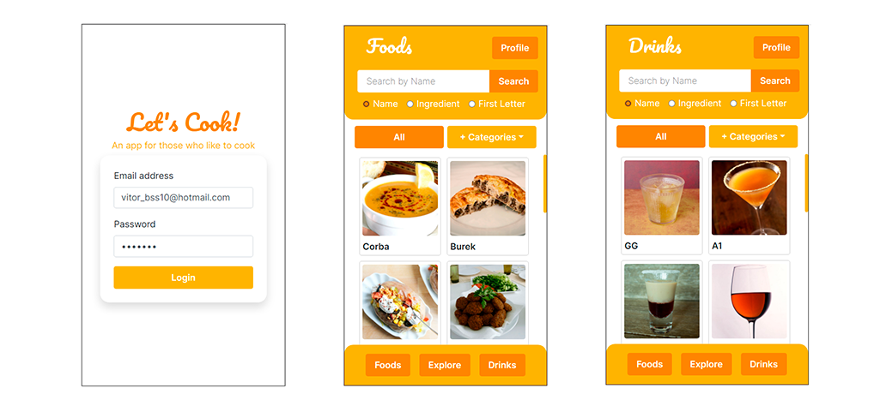
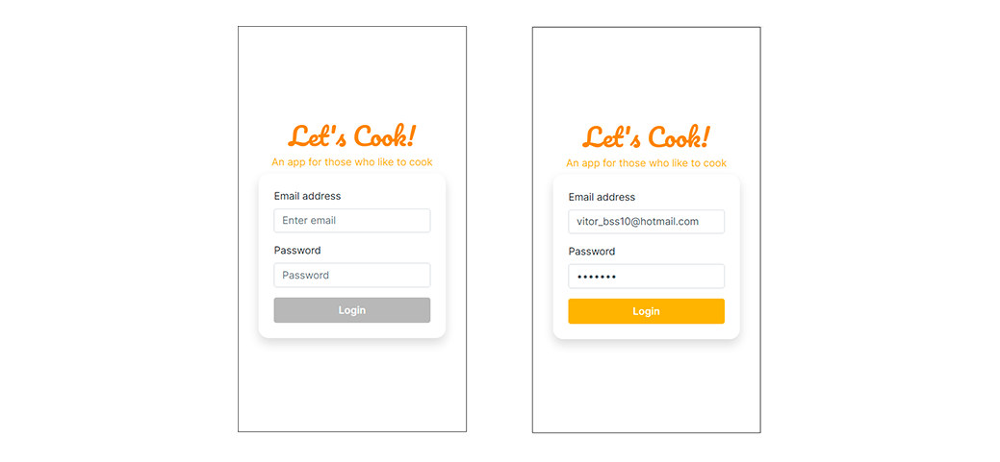
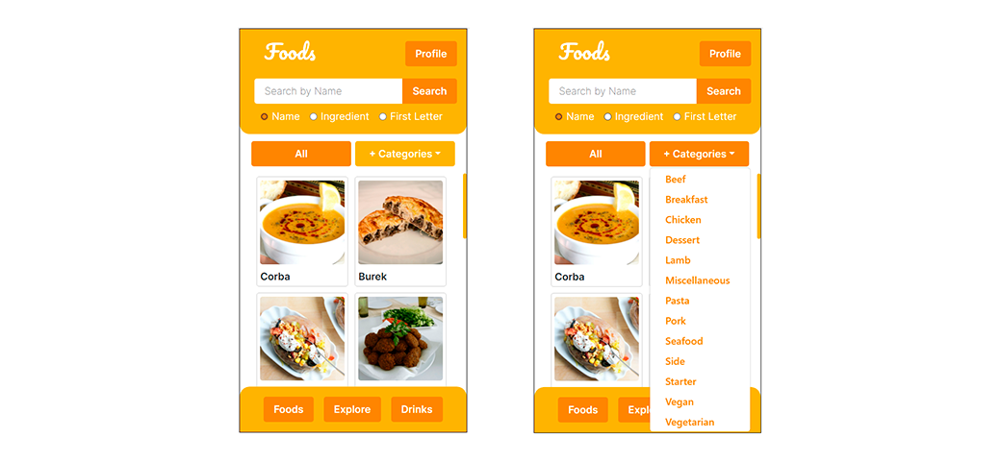
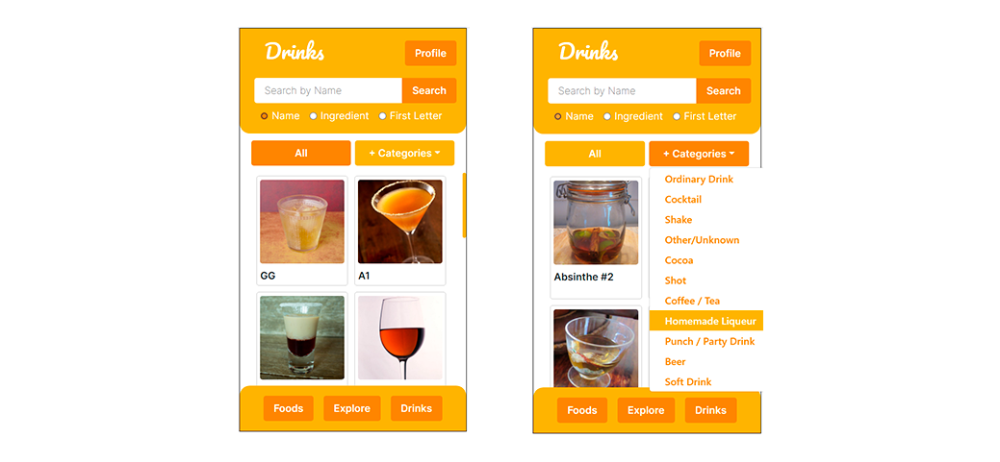
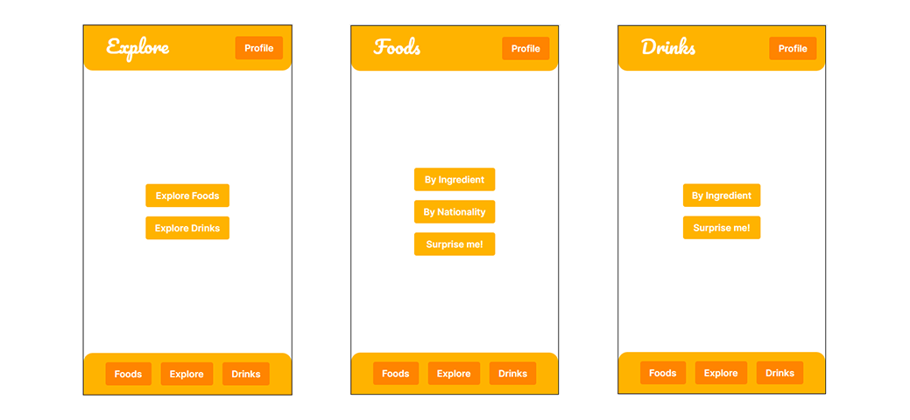
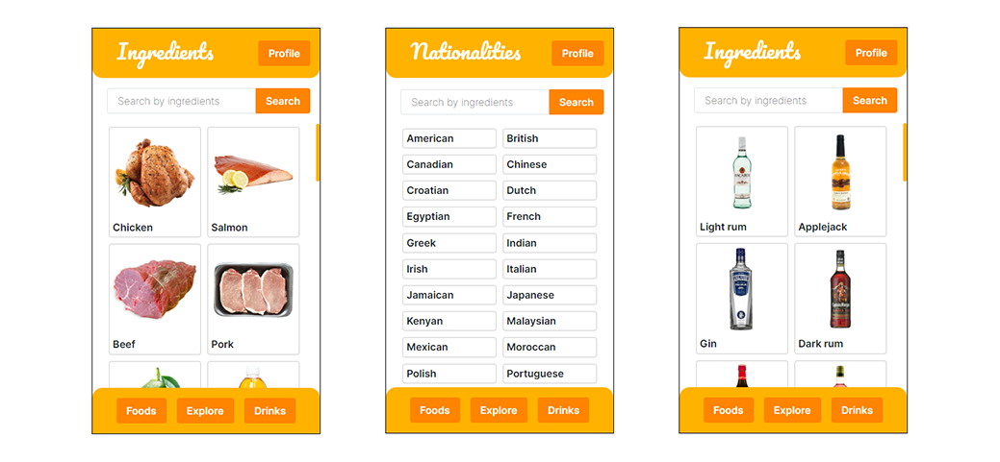
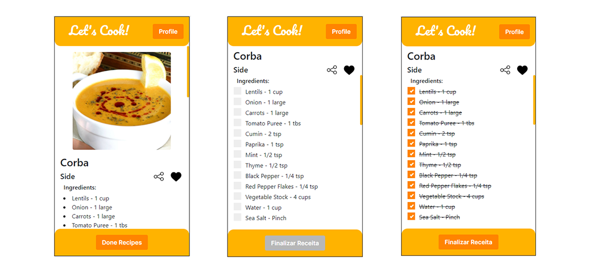
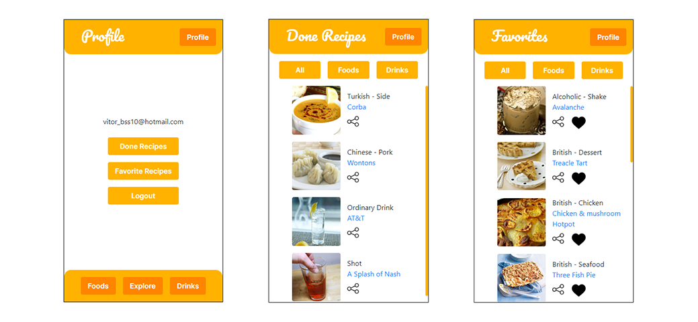

# App de Receitas - React, Context API e Bootstrap

Esse projeto é uma aplicação de receitas, onde é possível ver receitas de comidas e bebidas a partir das APIs do [TheMealDB](https://www.themealdb.com/api.php) e [TheCocktailDB](https://www.thecocktaildb.com/api.php). É possível acessar cada uma das receitas e ver detalhes sobre elas, como ingredientes e instruções. Também é possível favoritar receitas e marca-las como prontas a partir de checkboxes com os ingredientes necessários na tela de detalhes, e acessar na página de receitas prontas, da mesma forma que as favoritas. A aplicação também possui um sistema de busca, onde é possível pesquisar por nome de receitas ou ingredientes, além de filtros por categorias. É baseada em três principais páginas, de comidas, bebidas e explorar, que contém mais opções de receitas. A aplicação foi desenvolvida em React, utilizando Context API para gerenciar o estado global da aplicação, e Bootstrap para estilização.

Foi desenvolvido em grupo durante o curso de Desenvolvimento Web da Trybe, com os companheiros(a):
  - [Vinícius Teixeira](https://github.com/tex008)
  - [Luciano Freitas](https://github.com/Ludoug-f)
  - [Paula Henrique](https://github.com/henriquesPaula)
  - [Celso Fiorani](https://github.com/fioranicelso)

A aplicação pode ser testada aqui: [Recipe App](https://vitorbss12.github.io/Recipe-App-with-React-and-ContextAPI/) 



## Conteúdo

- [App de Receitas - React, Context API e Bootstrap](#app-de-receitas---react-context-api-e-bootstrap)
  - [Conteúdo](#conteúdo)
- [**Recursos App de Receitas**](#recursos-app-de-receitas)
    - [**Login**](#login)
    - [**Página Principal de Comidas**](#página-principal-de-comidas)
    - [**Página Principal de Bebidas**](#página-principal-de-bebidas)
    - [**Explorar**](#explorar)
    - [**Detalhes de Receita**](#detalhes-de-receita)
    - [**Perfil, Receitas Favoritas e Feitas**](#perfil-receitas-favoritas-e-feitas)
- [**Instruções**](#instruções)
    - [**Instalação**](#instalação)
    - [**Execução**](#execução)
- [**Linguagens e Ferramentas**](#linguagens-e-ferramentas)
    - [**React**](#react)
    - [**React Hooks**](#react-hooks)
    - [**Context API**](#context-api)
    - [**Local Storage**](#local-storage)
    - [**Bootstrap**](#bootstrap)
    - [**TheMealDB API e TheCocktailDB API**](#themealdb-api-e-thecocktaildb-api)
    - [**Linter**](#linter)
- [**Observações**](#observações)

# **Recursos App de Receitas**
Os recursos serão listados conforme as páginas.

### **Login**

A tela inicial da aplicação é a de login, onde o usuário pode acessar a aplicação com e-mail e senha. É apenas uma abstração de forms de login, e quando o usuário clica no botão de login, é redirecionado para a página de comidas e seu e-mail e token para as APIs são salvos no LocalStorage.



### **Página Principal de Comidas**

Essa é a primeira página acessada após o login, conta com um header com o nome da página e um botão para acessar a página de perfil. Logo abaixo uma barra de buscas podendo ser utilizada pelo nome, ingrediente ou primeira letra da receita. Em seguida os botões de categoria para filtrar receitas. O conteúdo principal da página é uma lista de receitas de comidas consumida pela API do TheMealDB, que podem ser acessadas clicando nelas. O usuário pode acessar a página de bebidas ou explorar clicando nos botões do footer.



### **Página Principal de Bebidas**

Funciona da mesma forma forma que a página de comidas, com a diferença de que a lista de receitas é consumida pela API do TheCocktailDB.



### **Explorar**

A página de explorar permite encontrar receitas de comidas e bebidas utilizando características das receitas. As comidas podem ser exploradas por ingrediente, região e de forma aleatória, enquanto as bebidas apenas por ingrediente e região.




### **Detalhes de Receita**

Cada receita possui uma página com suas informações, como nome, foto, ingredientes, instruções e recomendações. Nessa página o usuário pode adicionar a receita aos favoritos, compartilhar a receita, iniciar e finalizar a receita. O modelo de detalhes funciona da mesma forma para comidas e bebidas.



### **Perfil, Receitas Favoritas e Feitas**

A página de perfil permite que o usuário veja seu e-mail e acessar a página de receitas feitas e receitas favoritas, além de fazer logout que removera o e-mail do local storage.
A página de receitas feitas mostra as receitas que o usuário finalizou, e a página de receitas favoritas mostra as receitas que o usuário adicionou aos favoritos.



# **Instruções**

### **Instalação**

Para rodar a aplicação localmente é necessário fazer a instalação das dependências utilizadas com o comando:

```
npm install
```
### **Execução**

Depois de ter as dependências instaladas é possível executar o projeto localmente com o comando:

```
npm start
```

# **Linguagens e Ferramentas**

`React` é o coração da aplicação, foi desenvolvida utilizando componentes funcionais, `Hooks` disponíveis pelo React e também customizados, o estado da aplicação foi gerido utilizando `Context API` e a estilização foi feita com `Bootstrap` e `CSS`

### **React**

A aplicação foi componentizada utilizando `React`.

### **React Hooks**

Os principais hooks utilizados na aplicação foram `useState`, `useContext`, `useEffect` e `useHistory`, também foram desenvolvidos hooks customizados para a aplicação.

### **Context API**

`Context API` ficou responsável pelo estado global da aplicação para gerenciar alterações na busca, categorias, receitas favoritas e prontas.

### **Local Storage**

Essa aplicação não possui banco de dados, então pra simular esse comportamento foi utilizado o Local Storage do usuário para salvar informações, como e-mail, receitas favoritas, receitas prontas e token de acesso.

### **Bootstrap**

A aplicação teve estilização principal com `Bootstrap`.

### **TheMealDB API e TheCocktailDB API**

A API utilizada para as receitas de comidas é a [TheMealDB](https://www.themealdb.com/api.php). Já a API utilizada para as receitas de bebidas é a [TheCocktailDB](https://www.thecocktaildb.com/api.php).

### **Linter**

Este projeto foi desenvolvido utilizando o linter `ESLint` seguindo as boas práticas definidas na [Trybe](https://www.betrybe.com/).

Para executar o Lint utilize o comando:
````
npm run lint
````

Para executar o styleLint utilize o comando:
````
npm run lint:styles
````

# **Observações**

- Este é um projeto de estudo desenvolvido em grupo durante minha formação na [Trybe](https://www.betrybe.com/). :rocket:

- Este repositório está sendo monitorado pelo [SonarCloud](https://sonarcloud.io/) para avaliação de qualidade.

- Quer saber mais sobre mim? Veja o meu [LinkedIn](https://www.linkedin.com/in/vitorbss/).
